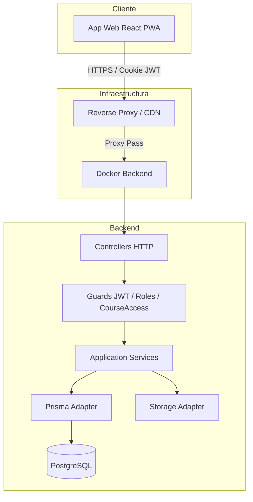
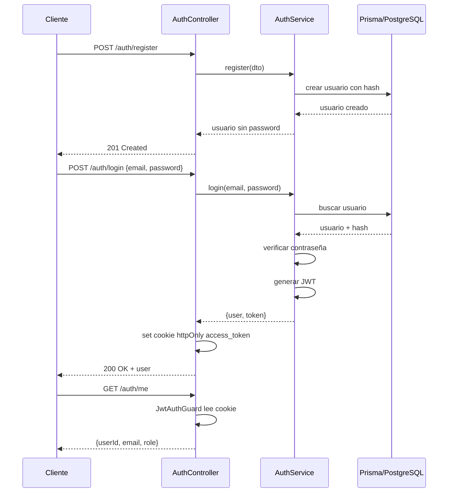
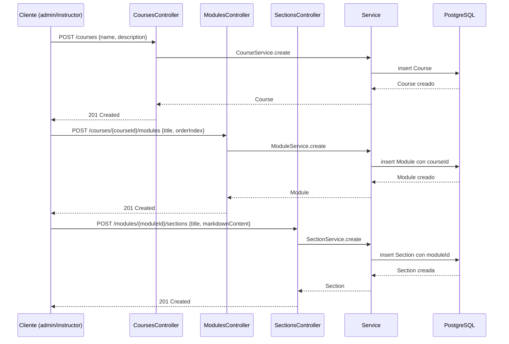
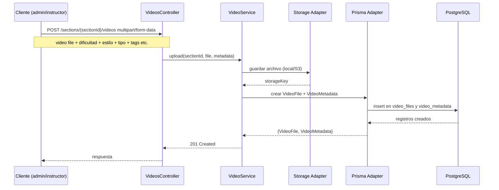
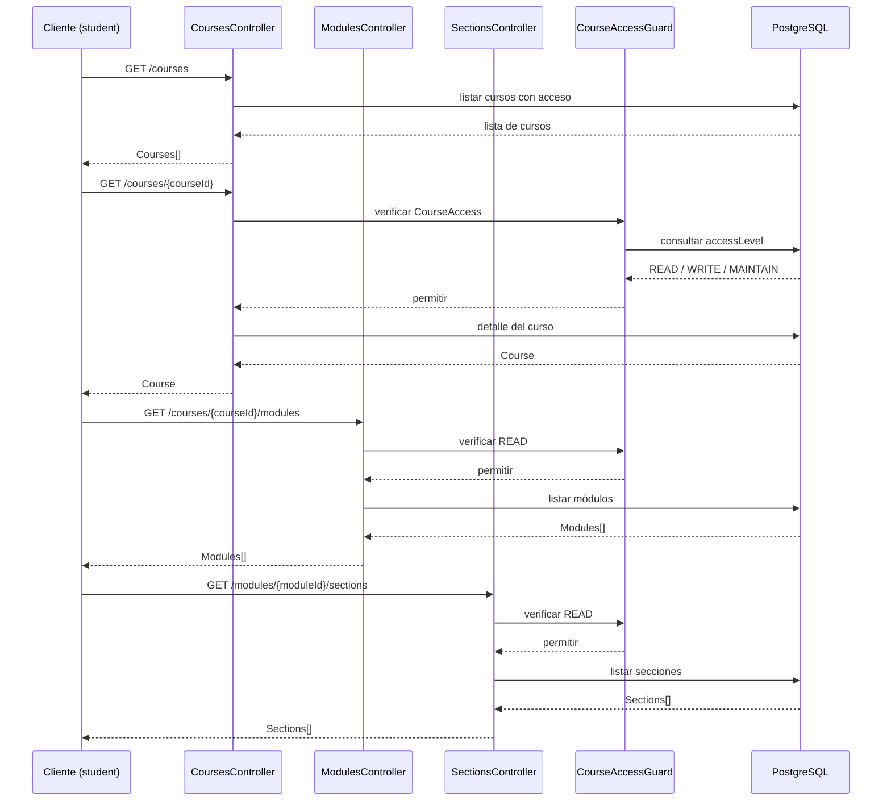
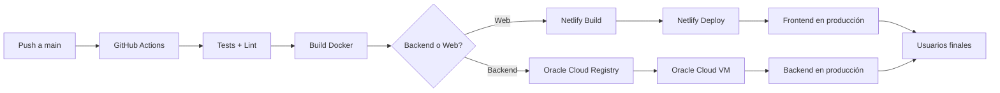

# Procesos

Este documento describe los principales flujos del sistema mediante diagramas Mermaid.

## Arquitectura general

## Flujo de autenticación

## Creación de curso / módulo / sección

## Subida de video y metadatos

## Flujo de estudiante

## Pipeline CI/CD y despliegue

